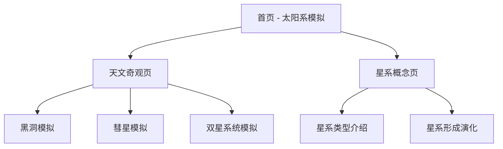

# 天文探索网站 - 产品需求文档

## 1. 产品概述
天文探索网站是一个交互式前端应用，通过视觉化展示和动画效果，帮助用户了解太阳系、天文奇观和星系概念。
- 主要目的是通过直观的视觉效果和动画，使复杂的天文知识变得易于理解和欣赏
- 目标用户包括天文爱好者、学生和对宇宙探索感兴趣的普通大众

## 2. 核心功能

### 2.1 用户角色
| 角色 | 注册方式 | 核心权限 |
|------|----------|----------|
| 普通用户 | 无需注册 | 浏览所有内容，使用交互功能 |

### 2.2 功能模块
1. **首页**：太阳系行星运转模拟，导航栏，天文奇观预览
2. **天文奇观页**：黑洞、彗星、双星系统等现象的可视化展示
3. **星系概念页**：星系类型、形成和演化的介绍

### 2.3 页面详情
| 页面名称 | 模块名称 | 功能描述 |
|----------|----------|----------|
| 首页 | 太阳系模拟 | 固定舒适视角展示行星轨道和运行，速度设计合理，体现差异 |
| 首页 | 导航栏 | 链接到其他页面，提供网站导航 |
| 首页 | 天文奇观预览 | 展示主要天文奇观的缩略图和简介 |
| 天文奇观页 | 黑洞模拟 | 展示黑洞的视觉效果和相关数据 |
| 天文奇观页 | 彗星模拟 | 展示彗星的运行轨迹和彗尾效果 |
| 天文奇观页 | 双星系统模拟 | 展示双星系统的运行和相互作用 |
| 星系概念页 | 星系类型介绍 | 展示不同类型星系的特征和示例 |
| 星系概念页 | 星系形成演化 | 介绍星系的形成过程和演化历史 |

## 3. 核心流程
用户访问首页，观察太阳系模拟，然后可以通过导航栏进入天文奇观页或星系概念页，探索不同的天文现象和概念。

## 4. 用户界面设计
### 4.1 设计风格
- 主色调：深蓝色 (#1a2b47) 和宇宙蓝 (#0b3d91)，辅以亮蓝色 (#3498db) 和金色 (#f1c40f) 作为强调色
- 按钮风格：圆角设计，带有微妙的发光效果，模拟宇宙星光
- 字体：主标题使用 Orbitron（太空风格字体），正文使用 Inter（现代无衬线字体）
- 布局风格：深色背景，卡片式布局，带有玻璃态效果
- 图标风格：简约线条风格，带有轻微的发光效果

### 4.2 页面设计概览
| 页面名称 | 模块名称 | UI元素 |
|----------|----------|--------|
| 首页 | 太阳系模拟 | 深色背景，Canvas 渲染的太阳系，行星带有纹理，轨道为半透明线条，太阳带有发光效果 |
| 首页 | 导航栏 | 顶部固定，半透明背景，带有星球图标，导航链接带有悬停效果 |
| 首页 | 天文奇观预览 | 卡片式布局，每个奇观带有缩略图和简短描述，悬停时放大效果 |
| 天文奇观页 | 黑洞模拟 | 中心为黑色球体，周围有吸积盘和引力透镜效果，背景为星空 |
| 天文奇观页 | 彗星模拟 | 带有彗尾效果的彗星，背景为星空，可调整观察角度 |
| 天文奇观页 | 双星系统模拟 | 两个恒星相互环绕，带有引力影响效果，可调整观察视角 |
| 星系概念页 | 星系类型介绍 | 卡片式布局，每个星系类型带有图片和详细描述 |
| 星系概念页 | 星系形成演化 | 时间轴形式展示，配有动画和图表 |

### 4.3 响应式设计
- 桌面优先设计，适配不同屏幕尺寸
- 移动设备上优化布局，确保模拟效果在小屏幕上依然流畅
- 触摸设备优化，支持手势控制视角

### 4.4 3D场景指导
- 环境/HDRI：深空背景，带有微弱的星光效果
- 光照设置：点光源模拟恒星，环境光提供基础照明
- 相机设置：固定视角，可通过用户交互调整
- 构图：中心对齐，确保主要天体在视野中心
- 交互：支持鼠标拖拽旋转视角，滚轮缩放
- 后处理效果：轻微的 bloom 效果增强星光感
- 性能预算：确保在中等配置设备上流畅运行，限制粒子数量和复杂度