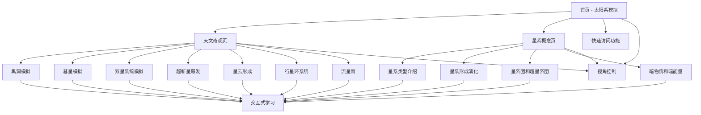

# 天文探索网站 - 产品需求文档

## 1. 产品概述
天文探索网站是一个交互式前端应用，通过视觉化展示和动画效果，帮助用户了解太阳系、天文奇观和星系概念。
- 主要目的是通过直观的视觉效果和动画，使复杂的天文知识变得易于理解和欣赏
- 目标用户包括天文爱好者、学生和对宇宙探索感兴趣的普通大众

## 2. 核心功能

### 2.1 用户角色
| 角色 | 注册方式 | 核心权限 |
|------|----------|----------|
| 普通用户 | 无需注册 | 浏览所有内容，使用交互功能，调整模拟参数 |

### 2.2 功能模块
1. **首页**：太阳系行星运转模拟，导航栏，天文奇观预览，快速访问功能
2. **天文奇观页**：黑洞、彗星、双星系统、超新星爆发、星云形成、行星环系统、流星雨等现象的可视化展示
3. **星系概念页**：星系类型、形成和演化、星系团和超星系团、暗物质和暗能量的介绍
4. **交互式学习**：提供天文知识卡片，可点击查看详细信息
5. **视角控制**：支持缩放、旋转和拖拽，调整观察角度

### 2.3 页面详情
| 页面名称 | 模块名称 | 功能描述 |
|----------|----------|----------|
| 首页 | 太阳系模拟 | 固定舒适视角展示行星轨道和运行，速度设计合理，体现差异，支持视角控制 |
| 首页 | 导航栏 | 链接到其他页面，提供网站导航，包含快速访问按钮 |
| 首页 | 天文奇观预览 | 展示主要天文奇观的缩略图和简介，点击可直接进入对应奇观 |
| 首页 | 快速访问 | 提供常用功能的快速入口，如视角重置、速度调整等 |
| 天文奇观页 | 黑洞模拟 | 展示黑洞的视觉效果和相关数据，包括吸积盘、引力透镜等现象，可调整参数 |
| 天文奇观页 | 彗星模拟 | 展示彗星的运行轨迹和彗尾效果，可调整彗星轨道参数 |
| 天文奇观页 | 双星系统模拟 | 展示双星系统的运行和相互作用，可调整恒星质量和距离 |
| 天文奇观页 | 超新星爆发 | 展示超新星爆发的视觉效果和过程，包括冲击波和光线爆发 |
| 天文奇观页 | 星云形成 | 展示星云的形成和演化过程，带有色彩渐变效果 |
| 天文奇观页 | 行星环系统 | 展示土星等行星的环系统，包括环的结构和组成 |
| 天文奇观页 | 流星雨 | 展示流星雨的视觉效果，可调整流星雨强度和方向 |
| 星系概念页 | 星系类型介绍 | 展示不同类型星系的特征和示例（椭圆星系、螺旋星系、不规则星系等），包含详细数据 |
| 星系概念页 | 星系形成演化 | 介绍星系的形成过程和演化历史，通过时间轴展示关键阶段 |
| 星系概念页 | 星系团和超星系团 | 介绍星系的聚集形式，展示不同尺度的星系结构 |
| 星系概念页 | 暗物质和暗能量 | 介绍宇宙中的暗物质和暗能量概念，通过可视化效果展示其作用 |
| 全局 | 交互式学习 | 提供天文知识卡片，可点击查看详细信息，包含真实数据和科普内容 |
| 全局 | 视角控制 | 支持缩放、旋转和拖拽，调整观察角度，适应不同设备操作方式 |

## 3. 核心流程
用户访问首页，观察太阳系模拟，然后可以通过导航栏进入天文奇观页或星系概念页，探索不同的天文现象和概念。

## 4. 用户界面设计
### 4.1 设计风格
- 主色调：深蓝色 (#1a2b47) 和宇宙蓝 (#0b3d91)，辅以亮蓝色 (#3498db) 和金色 (#f1c40f) 作为强调色
- 按钮风格：圆角设计，带有微妙的发光效果，模拟宇宙星光
- 字体：主标题使用 Orbitron（太空风格字体），正文使用 Inter（现代无衬线字体）
- 布局风格：深色背景，卡片式布局，带有玻璃态效果
- 图标风格：简约线条风格，带有轻微的发光效果

### 4.2 页面设计概览
| 页面名称 | 模块名称 | UI元素 |
|----------|----------|--------|
| 首页 | 太阳系模拟 | 深色背景，Canvas 渲染的太阳系，行星带有纹理，轨道为半透明线条，太阳带有发光效果，支持鼠标/触摸交互 |
| 首页 | 导航栏 | 顶部固定，半透明背景，带有星球图标，导航链接带有悬停效果，包含快速访问按钮 |
| 首页 | 天文奇观预览 | 卡片式布局，每个奇观带有缩略图和简短描述，悬停时放大效果，点击进入对应奇观 |
| 首页 | 快速访问 | 浮动工具栏，包含视角重置、速度调整、全屏等按钮，带有图标和tooltip |
| 天文奇观页 | 黑洞模拟 | 中心为黑色球体，周围有吸积盘和引力透镜效果，背景为星空，右侧有参数调整面板 |
| 天文奇观页 | 彗星模拟 | 带有彗尾效果的彗星，背景为星空，可调整观察角度，右侧有轨道参数调整面板 |
| 天文奇观页 | 双星系统模拟 | 两个恒星相互环绕，带有引力影响效果，可调整观察视角，右侧有恒星参数调整面板 |
| 天文奇观页 | 超新星爆发 | 展示恒星爆炸的视觉效果，包括冲击波和光线爆发，右侧有爆发参数调整面板 |
| 天文奇观页 | 星云形成 | 展示气体和尘埃云的形成过程，带有色彩渐变效果，右侧有星云参数调整面板 |
| 天文奇观页 | 行星环系统 | 展示土星等行星的环系统，包括环的结构和组成，可调整观察角度 |
| 天文奇观页 | 流星雨 | 展示流星划过夜空的视觉效果，可调整流星雨强度和方向，右侧有参数调整面板 |
| 星系概念页 | 星系类型介绍 | 卡片式布局，每个星系类型带有图片和详细描述，包括椭圆星系、螺旋星系、不规则星系等，点击卡片展开详细信息 |
| 星系概念页 | 星系形成演化 | 时间轴形式展示，配有动画和图表，展示星系从形成到演化的过程，可点击时间点查看详情 |
| 星系概念页 | 星系团和超星系团 | 展示星系的聚集形式，包括不同尺度的星系结构，带有缩放功能 |
| 星系概念页 | 暗物质和暗能量 | 通过可视化效果展示暗物质和暗能量的概念和作用，带有交互式演示 |
| 全局 | 交互式学习 | 知识卡片样式，点击展开详细信息，包含真实数据和科普内容，带有动画效果 |
| 全局 | 视角控制 | 鼠标/触摸手势支持，包括缩放、旋转、拖拽，屏幕边缘有视角控制提示 |

### 4.3 响应式设计
- 桌面优先设计，适配不同屏幕尺寸
- 移动设备上优化布局，确保模拟效果在小屏幕上依然流畅
- 触摸设备优化，支持手势控制视角

### 4.4 3D场景指导
- 环境/HDRI：深空背景，带有微弱的星光效果
- 光照设置：点光源模拟恒星，环境光提供基础照明
- 相机设置：固定视角，可通过用户交互调整
- 构图：中心对齐，确保主要天体在视野中心
- 交互：支持鼠标拖拽旋转视角，滚轮缩放
- 后处理效果：轻微的 bloom 效果增强星光感
- 性能预算：确保在中等配置设备上流畅运行，限制粒子数量和复杂度