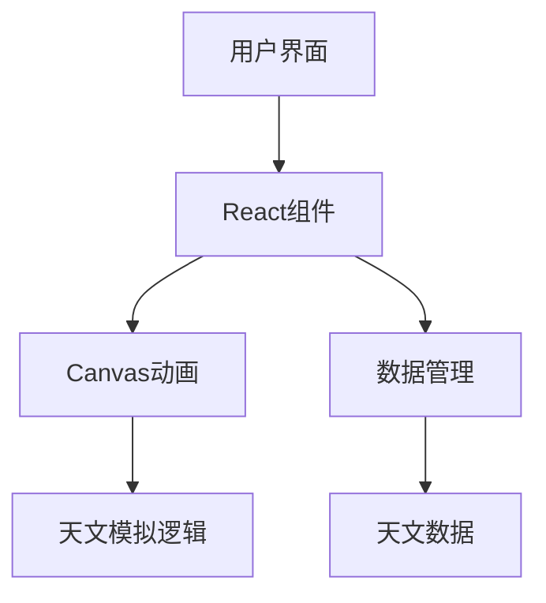

# 天文探索网站 - 技术架构文档

## 1. 架构设计



## 2. 技术描述
- 前端：React@18 + TypeScript + Tailwind CSS + Vite
- 动画实现：Canvas API + requestAnimationFrame
- 3D效果：Three.js（可选，用于复杂场景）
- 字体：Google Fonts (Orbitron, Inter)
- 状态管理：React Context API（轻量级状态）

## 3. 路由定义
| 路由 | 用途 |
|------|------|
| / | 首页 - 太阳系模拟 |
| /wonders | 天文奇观页 |
| /galaxies | 星系概念页 |

## 4. 数据模型

### 4.1 太阳系数据
```typescript
interface Planet {
  id: string;
  name: string;
  radius: number; // 相对半径
  distance: number; // 与太阳的距离
  orbitalPeriod: number; // 轨道周期（天）
  rotationPeriod: number; // 自转周期（天）
  color: string; // 行星颜色
  texture?: string; // 纹理URL（可选）
}

interface SolarSystem {
  sun: {
    radius: number;
    color: string;
  };
  planets: Planet[];
}
```

### 4.2 天文奇观数据
```typescript
interface Wonder {
  id: string;
  name: string;
  description: string;
  type: 'blackHole' | 'comet' | 'binaryStar' | 'supernova' | 'nebula' | 'planetRing' | 'meteorShower';
  data: any; // 特定类型的额外数据
}
```

### 4.3 星系数据
```typescript
interface Galaxy {
  id: string;
  name: string;
  type: string;
  description: string;
  image: string;
}

interface GalaxyFormation {
  stage: number;
  title: string;
  description: string;
  image: string;
}
```

## 5. 核心组件设计

### 5.1 太阳系模拟组件
- `SolarSystemCanvas`: 负责渲染太阳系和行星运动
- `Planet`: 单个行星的渲染逻辑
- `Orbit`: 行星轨道的渲染

### 5.2 天文奇观组件
- `BlackHoleSimulator`: 黑洞模拟
- `CometSimulator`: 彗星模拟
- `BinaryStarSimulator`: 双星系统模拟
- `SupernovaSimulator`: 超新星爆发模拟
- `NebulaSimulator`: 星云形成模拟
- `PlanetRingSimulator`: 行星环系统模拟
- `MeteorShowerSimulator`: 流星雨模拟

### 5.3 星系概念组件
- `GalaxyTypeCard`: 星系类型卡片
- `GalaxyFormationTimeline`: 星系形成时间轴
- `GalaxyClusterComponent`: 星系团和超星系团展示
- `DarkMatterEnergyComponent`: 暗物质和暗能量可视化

## 6. 性能优化策略
- 使用 `useRef` 存储Canvas上下文，避免重复获取
- 实现动画节流，确保在低性能设备上也能流畅运行
- 使用 `React.memo` 优化组件重渲染
- 图片懒加载，特别是星系和天文奇观的大图
- 合理使用 `requestAnimationFrame`，避免过度渲染

## 7. 响应式设计实现
- 使用 Tailwind CSS 的响应式类
- 在小屏幕设备上简化动画效果，减少粒子数量
- 触摸设备支持手势控制，如双指缩放、单指拖动

## 8. 构建与部署
- 使用 Vite 进行开发和构建
- 构建输出优化，包括代码分割和压缩
- 部署到静态网站托管服务，如 Vercel 或 Netlify